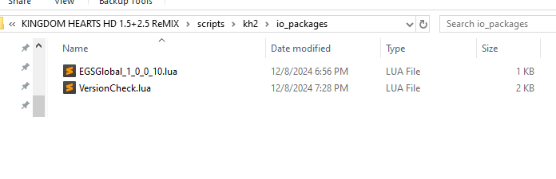
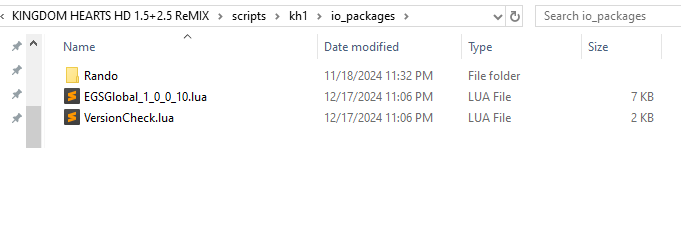
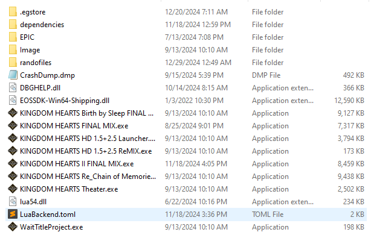

## Update status
All mods have been updated to work with the following versions:
- Epic Games: 1.0.0.8 (Global + JP)
- Epic Games: 1.0.0.9 (Global + JP)
- Epic Games: 1.0.0.10 (Global + JP)
- Steam: 1.0.0.1 (Global + JP)
- Steam: 1.0.0.2 (Global + JP)

## Disclaimer:
If you are setting up for 1FM Rando there is an extra document [here](RANDO.md)!

Not all of these scripts are allowed in speedruns, the following are allowed:
- Hook Ship
- Save Anywhere (for soft resetting only)
- Fast Camera
- 4 by 3
- Volume 0

## How to use:

### Pre-reqs
- If you have not already, or run into language you are unfamiliar with go read through the [glossary](GLOSSARY.md) for terms that are used throughout. If there is word or short hand use that is still unclear please reach out so it can be added!
- Please follow the instruction [here](../LUA.md) to setup one of the hook programs to actually run mods then continue

### Setup
- For LuaBackend:
    - Open the `game data` folder (found in `Documents` as `KINGDOM HEARTS HD 1.5+2.5 ReMIX`)
    - Open the `scripts` folder
    - Open the `kh1` folder
- For LuaFrontend:
    - Open the folder you extracted to start (named `LuaFrontend.v1.15` by default)
    - Open the `scripts` folder
    - Open the `kh1` folder
- For OpenKH Mod Manager:
    - Skip down to [here](#omm_skip)
- Copy in any desired mod files (either from the full download or from [here](scripts))
- Create the `io_packages` folder (or copy it if you downloaded the repo as a zip)
- (optional) If you copied the folder you can delete all version files aside from the one you intend to use
- Your scripts folder should look something like this:  

- If you created the folder yourself we need to copy two files from into it, open your new `io_packages` folder and:
    - Copy the version lua file for your version from the repo into it from the list below:
        - [EGSGlobal_1_0_0_10.lua](scripts/io_packages/EGSGlobal_1_0_0_10.lua) (Current English Epic Games)
        - [EGSGlobal_1_0_0_9.lua](scripts/io_packages/EGSGlobal_1_0_0_9.lua)
        - [EGSGlobal_1_0_0_8.lua](scripts/io_packages/EGSGlobal_1_0_0_8.lua)
        - [EGSJP_1_0_0_10.lua](scripts/io_packages/EGSJP_1_0_0_10.lua) (Current Japanese Epic Games)
        - [EGSJP_1_0_0_9.lua](scripts/io_packages/EGSJP_1_0_0_9.lua)
        - [EGSJP_1_0_0_8.lua](scripts/io_packages/EGSJP_1_0_0_8.lua)
        - [SteamGlobal_1_0_0_2.lua](scripts/io_packages/SteamGlobal_1_0_0_2.lua) (Current English Steam)
        - [SteamGlobal_1_0_0_1.lua](scripts/io_packages/SteamGlobal_1_0_0_1.lua)
        - [SteamJP_1_0_0_2.lua](scripts/io_packages/SteamJP_1_0_0_2.lua) (Current Japanese Steam)
        - [SteamJP_1_0_0_1.lua](scripts/io_packages/SteamJP_1_0_0_1.lua)
    - Copy the [VersionCheck.lua](scripts/io_packages/VersionCheck.lua) file
- Your `io_packages` folder should look something like this:  

- If you are installing randomizer mods continue [here](#rando)

* If you wish to add or remove a script while playing simply copy to or delete it from the folder and press `F1` while the game is focused to reload scripts
* As a note you do not need to have the scripts in more than one place if you are playing across both Epic and Steam

###  Setup - Open KH Mod Manager
- For each mod you wish to install do the following:
    - Open the `Install a new mod` window through the green plus, mods drop down, or keyboard shortcut
    - Press the `Select and install Mod Archive or Lua Script` button
    - Browse to one of the following locations to find the mod files to add:
        - Download of repo:
            - Unzip (if you have not yet) the downloaded repo
            - Open the `1FMMods` folder
            - Open the scripts folder
            - Select your mod
        - Installed with OpenKH setup from `LUA.md`:
            - Navigate to your unzipped `openkh` folder
            - Open the `mods` folder
            - Open the folder for whichever game you used in setup
            - Open the `Denhonator` folder (if this folder is not present check other game folders for the last step)
            - Open the `KHPCSpeedrunTools` folder
            - Open the `1FMMods` folder
            - Select your mod
    - Repeat these steps for each mod you wish to include
- If you are installing randomizer mods continue [here](#rando)

###  Setup - Rando
There are a few extra steps if you want to use one of the randomizer mods, follow along here:
- Open the scripts folder where you have placed the `.lua` mod files from the previous step
- Open the `io_packages` folder
- Copy the [Rando](scripts/io_packages/Rando) folder into this folder
- The `io_packages` folder should look like this now:  

- Open the `game install` folder:
    - For Epic Games:
        - Open Epic Games Launcher
        - Go to Library
        - Click the `...` next to the game
        - Click `Manage`
        - Click the folder icon next to `Installation`
    - For Steam:
        - Open Steam
        - Go to Library
        - Go to the game
        - Click the gear icon
        - Select `Properties...`
        - Select the `Installed Files` tab in the new window
        - Select `Browse...`
- Creat a new folder here named `randofiles` or copy the file from [here](rando_files)
- (optional) If you are using a supported translation language copy the `.txt` file for it into the new `randofiles` folder from [here](randofiles)
- Your install folder should look like this now (Epic Games version used as example):  

## SaveAnywhere:
- In-game, press L1+L2+R2+Select (or equivalent on your input device)
- You can use this to save anywhere. Saving during cutscenes or combat may have unexpected consequences.
- You can also instantly die with R1+R2+L2+Select
- You can also instantly load continue state with R1+R2+L1+L2+D-pad left
- You can also instantly load autosave with R1+R2+L1+L2+D-pad right
 - Most recent continue state is written to a local file that carries between restarting the game
 - Can be loaded straight from the title screen
 - The save can be found in the Lua .exe/.dll folder
 - Might have weird bugs, might save you from losing a lot of progress
- You can also soft reset with R1+R2+L1+L2+Start

## InstantGummi:
- Instantly arrive at any selected world
- Warp points are disabled
- Warp drive is disabled (it'd be slower)
- Attempting to travel to Halloween Town or Atlantica will take you to Monstro if it has not yet been visited
- To go to Hollow Bastion 2, select the warp point that takes you there
- There is a possibility that going to Deep Jungle or Neverland for the first time will not initiate the opening cutscenes. In this case, report the issue. You can progress the game by going to treehouse/cabin

## HookShip:
- Causes the ship to always appear when traveling to Neverland for the first time

## Unskippable:
- Allows skipping unskippable cutscenes (Wonderland, HB2)
- Can not skip text boxes or "mini cutscenes" such as drinking enlarge/shrink potions in Wonderland

## EarlySkip:
- Allows skipping cutscenes earlier
- May cause glitches

## FasterDialog:
- Makes text boxes appear and disappear almost instantly
- Text speed unaffected unless you change textSpeedup to true (line 2)
 - This feature is a little wacky so it's disabled by default

## FasterAnims:
- Speeds "mini cutscenes" as well as room transitions
- Also speeds up summon animations. If you don't want that, replace "summonSpeedup = true" with "summonSpeedup = false"
- Default speed multiplier is 2.0, but you can change it to anything you like

## Autoattack:
- Holding down attack allows Sora to perform physical attack combos automatically
- This will guarantee very quick combos
- Made for accessibility reasons

## RandoSomeLogic:
- Randomizes items, level ups, rewards, magic, trinities and chests
- If seed.txt exists, it will try to use it. Otherwise, the file will be created with a random seed
- Combine with SaveAnywhere and InstantGummi to get to world map right away. Everything will be open

## EnemyRando:
- Randomizes most bosses and some enemies within restraints of (hopefully) not crashing
- If seed.txt exists, it will try to use it. Otherwise, the file will be created with a random seed
- Scales bosses to match the location
- Probably has some issues. Send enemyrandolog.txt from randofiles folder and description of issue
- Hold start and only start during all black screens to skip randomization of that room

## Chaos:
- Randomizes many things in wild, chaotic ways, including attack animations
- Use for silly times

## ConsistentFinishers:
- Makes Zantetsuken, Gravity Break and Stun Impact trigger 100% of the time
- Priority: Stun Impact -> Gravity Break -> Zantetsuken

## Unlock0Volume:
- Setting BGM volume to 1 mutes it

## FastCamera:
- Speeds up the camera and its acceleration
- Makes camera centering instant
- You can adjust the numbers in the script to your liking

## 4By3:
- Sets the aspect ratio of the game to 4:3
- You can set the resolution via display settings or by resizing the window directly. That height will be applied and width cut to match 4:3
- Visit display settings to get rid of black bars
- Menus appear slightly cut-off since they were made for 16:9

## 1HP:
- Forces Sora's max HP to 1 at all times
- Removes beeping noise

## Achievements:
- Displays in Lua console when you get achievements and overall progress, independent of EGS achievement progress
- Saves achievements locally in achievements.txt, in game install folder or Lua .exe folder depending on Lua program
- Delete achievements.txt to reset achievements
