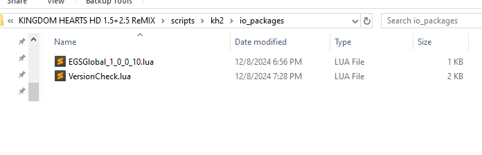

## Update status
All mods have been updated to work with the following versions:
- Epic Games: 1.0.0.9 (Global + JP)
- Epic Games: 1.0.0.10 (Global + JP)
- Steam: 1.0.0.1 (Global + JP)
- Steam: 1.0.0.2 (Global + JP)

## Disclaimer:
Not all of these scripts are allowed in speedruns

## How to use:

### Pre-reqs
- If you have not already, or run into language you are unfamiliar with go read through the [glossary](GLOSSARY.md) for terms that are used throughout. If there is word or short hand use that is still unclear please reach out so it can be added!
- Please follow the instruction [here](../LUA.md) to setup one of the hook programs to actually run mods then continue

### Setup
- For LuaBackend:
    - Open the `game data` folder (found in `Documents` as `KINGDOM HEARTS HD 1.5+2.5 ReMIX`)
    - Open the `scripts` folder
    - Open the `kh2` folder
- For LuaFrontend:
    - Open the folder you extracted to start (named `LuaFrontend.v1.15` by default)
    - Open the `scripts` folder
    - Open the `kh2` folder
- For OpenKH Mod Manager:
    - Skip down to [here](#omm_skip)
- Copy in any desired mod files (either from the full download or from [here](scripts))
- Create the `io_packages` folder (or copy it if you downloaded the repo as a zip)
- (optional) If you copied the folder you can delete all version files aside from the one you intend to use
- Your scripts folder should look something like this:  

- If you created the folder yourself we need to copy two files from into it, open your new `io_packages` folder and:
    - Copy the version lua file for your version from the repo into it from the list below:
        - [EGSGlobal_1_0_0_10.lua](scripts/io_packages/EGSGlobal_1_0_0_10.lua) (Current English Epic Games)
        - [EGSGlobal_1_0_0_9.lua](scripts/io_packages/EGSGlobal_1_0_0_9.lua)
        - [EGSJP_1_0_0_10.lua](scripts/io_packages/EGSJP_1_0_0_10.lua) (Current Japanese Epic Games)
        - [EGSJP_1_0_0_9.lua](scripts/io_packages/EGSJP_1_0_0_9.lua)
        - [SteamGlobal_1_0_0_2.lua](scripts/io_packages/SteamGlobal_1_0_0_2.lua) (Current English Steam)
        - [SteamGlobal_1_0_0_1.lua](scripts/io_packages/SteamGlobal_1_0_0_1.lua)
        - [SteamJP_1_0_0_2.lua](scripts/io_packages/SteamJP_1_0_0_2.lua) (Current Japanese Steam)
        - [SteamJP_1_0_0_1.lua](scripts/io_packages/SteamJP_1_0_0_1.lua)
    - Copy the [VersionCheck.lua](scripts/io_packages/VersionCheck.lua) file
- Your `io_packages` folder should look something like this:  

* If you wish to add or remove a script while playing simply copy to or delete it from the folder and press `F1` while the game is focused to reload scripts
* As a note you do not need to have the scripts in more than one place if you are playing across both Epic and Steam

###  Setup - Open KH Mod Manager
- Open the `Collection Settings` menu via the button on the right side:

- Select any and all mods in this pop up you wish to run with
- Close the pop up
- In the `Patching` menu select one of the `Build` options

### AutoAttack:
- Allows physically attacking continuously by holding attack button in combat.

### Autosave:
- Automatically saves the latest continue state to a local file
- Load the autosave by holding select (touch pad on EGS, left side of touch pad or options for Steam) when loading any save (or equivalent on your input device)
- Alternatively load secondary auto save with L2 + R2 (or equivalent on your input device)

### CreditSkip:
- Allows scene skipping of credits
- Skip the credits like you would a cutscene

### GummiSkip:
- As worlds get unlocked, you can enter them without having to do gummi missions

### LaserDomeSkip:
- Autmatically skip laser dome RC segment of final Xemnas fight

### LoadSaveMenu:
- Allows the in game opening of the save/load menu where possible
- Normally opens with just start, during x opens with Start + R2 (or equivalent on your input device)

### QuickHP0:
- Instantly set your HP to 0
- Trigger with L2 + R2 (or equivalent on your input device)

### SaveAnywhere:
- Bring up the save menu anywhere, which allows going to world map
- In-game, press L2 + R2 + R1 (or equivalent on your input device) to prompt and follow with Triangle (or equivalent on your input device) to open
- Works by replacing Auto Valor command, which may have some limitations
- Saving when you normally wouldn't be able to may or may not work well

### SoftReset:
- In-game, press L1 + L2 + R1 + R2 + Start (or equivalent on your input device)
- Also resets RNG
- Sound effects may get muffled over time. This is a known bug in the game unrelated to this script. Hard reset when that happens.
