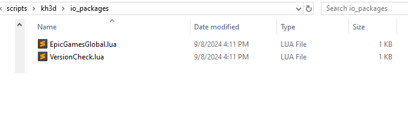
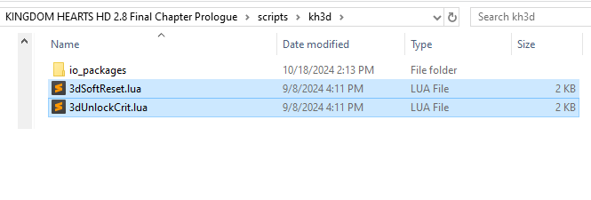

## Update status
All mods have been updated to work with Epic Games release 1.0.0.10 and Steam 1.0.0.2

## Disclaimer:
At the time of this update mods are not allowed for use with runs submitted to speedrun.com

## How to use:

### LuaBackend or LuaFrontend
- Get LuaBackend https://github.com/Sirius902/LuaBackend
- or get LuaFrontend https://github.com/TopazTK/LuaFrontend
- Follow the instructions on those pages on how to set up the scripts, or the LUA.md at the base of this repo.
- Create or copy the `io_packages` folder (can be found inside scripts here) inside of your bbs scripts folder from the previous install step. (Should have something like scripts/bbs/io_packages)
- If you created the folder yourself copy the version lua files for your version from the repo into it, ie. `EpicGamesGlobal.lua` for English Epic Games.
- Likewise to the last step copy in the `VersionCheck.lua` file.
- These two files should live inside `io_packages` which should be inside the game folder inside the `scripts` folder.
- Your `io_packages` folder should look something like this: 
- Finally place any scripts you intend to use at the base level of scripts and start the game.
- Your scripts folder should look something like this: 
- If you wish to add or remove a script while playing simply copy to or delete it from the folder and press `F1` while the game is focused to reload scripts.
- As a note you do not need to have the scripts in more than one place if you are playing across both Epic and Steam

### SoftReset
- Press all shoulder buttons + start (or equivalent on your input device) to instantly soft reset
