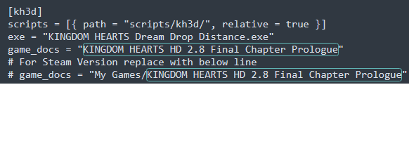
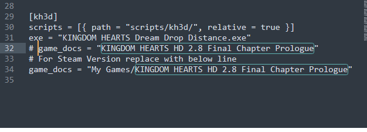
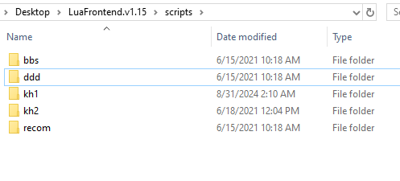
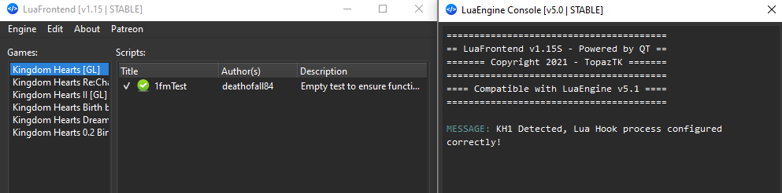
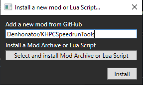

# Setting up
So you are having issues getting things working for one of the Lua tools. Fear not this document will get you squared away! Follow ONE of the bellow setups for a Lua tool, then carry on into game specific mods! This is step one and the game specific document is step two.

## Before you start
If you have not already, or run into language you are unfamiliar with go read through the [glossary](GLOSSARY.md) for terms that are used throughout. If there is word or short hand use that is still unclear please reach out so it can be add!

## Disclaimer
If you are setting up for Dream Drop Distance follow the steps [here](LUA_DDD.md) instead as there are minor changes.

If you are setting up for 1FM Rando with OpenKH there is an extra document [here](RANDO.md)!

## Jump to
- [LuaBackend](#lb)
- [LuaFrontend](#lf)
- [OpenKH Mod Manager](#omm)
- [Game Specific Mods](#mods)

## LuaBackend

### Prep
- First locate your game install folder:
	- For Epic Games:
		- Open the Epic Games Launcher
		- Go to `Library`
		- Right click the game
		- Click `Manage`
		- Click the magnifying glass on the `Installation` line
	- For Steam:
		- Open Steam
		- Select the game from your `Library`
		- Click the gear icon and select `Properties`
		- Select the `Installed Files` tab
		- Click the `Browse...` button
- In another file explorer window open your `Documents` folder
	- For Epic Games:
		- You should see a folder named `KINGDOM HEARTS HD 1.5+2.5 ReMIX`
		- Open this folder (this is the `game data` folder moving forward)
		- You should have something like `C:\Users\<your_user_name>\Documents\KINGDOM HEARTS HD 1.5+2.5 ReMIX`
		- It will look something like this:  
		
	- For Steam:
		- You should see a `My Games` folder
		- Open `My Games` and you should now see a folder named `KINGDOM HEARTS HD 1.5+2.5 ReMIX`
		- Open this folder (this is the `game data` folder moving forward)
		- You should have something like `C:\Users\<your_user_name>\Documents\My Games\KINGDOM HEARTS HD 1.5+2.5 ReMIX`
		- It will look something like this:  
		
- Next download `DBGHELP.zip` from [here](https://github.com/Sirius902/LuaBackend/releases) and unzip the contents into the game install folder you just found. This will unpack three files, `DBGHELP.dll`, `lua54.dll`, and `LuaBackend.toml`.

For Epic Games it should end up looking like this:

For Steam that would look like this:

#### Steamdeck extra steps
- Rename the `DBGHELP.dll` file to `DINPUT8.dll` that you placed in the game install folder
- In the `General` section of game properties on Steam, add the following as the `Launch Options`: `WINEDLLOVERRIDES="dinput8=n,b" %command%`

### Config
Our next goal is to ensure a proper `LuaBackend.toml` file setup:
- Open `LuaBackend.toml` in a text editor (notepade for example)
	- We will be setting the `game_docs` line relative to which platform you are installed on (if you have both you can choose one instead of doing both but they will end up shared)
	- Note after this you should have ONE `game_docs` line per game that does not start with a `#` matching what is described above, any additional `game_docs` lines can stay as long as they start with `#` and a space or be deleted entirely
	- For Epic Games this looks like:  
	
	- For Steam this looks like:  
	

### Scripts
From here on we will be in the `game data` folder we opened earlier.
- Create a new folder called `scripts`
- Inside the new `scripts` folder add the following for each game you wish to have mods for:
	- KH1: Create a new folder called `kh1`
	- KH2: Create a new folder called `kh2`
	- BBS: Create a new folder called `bbs`
	- ReCoM: Create a new folder called `recom`

A setup that includs Kingdom Hearts 1, 2, Re: Chain of Memories, and Birth by Sleep will look like this:

### Testing

As a last step we are going to run a test. For this example we will be using Kingdom Hearts 1 but any of the other games can be directly swapped.

- In the newly created `kh1` folder copy the `test_kh1.lua` found in the [test_lua](test_lua) folder
- Boot the game either through Steam or Epic Games
- Start up Kingdom Hearts 1 from the KH Launcher
- Once KH 1 is loaded Press `F2`
- You will know you are good to go if you get a window that looks like this:  

- To clean up delete `test_kh1.lua` and continue from one of the [game specific links](#mods)

## LuaFrontend

### Install

Grab the most recent release .rar file from [here](https://github.com/TopazTK/LuaFrontend/releases) and extract it wherever you like, this will be the `extracted folder`.

### Config

- Open the newley `extracted folder`
- Open the `config` folder inside
- Open the `gameConfig.toml` file from this folder in a text editor (notepade for example)
- Set each `Offset` and `Address` line to `"0"`
- (Optional, but recommended for this guide) Change the `Path` lines that include a `gl` to remove the `gl`

You should end up with a file that looks like this:  

### Scripts

- Go back to the top level of the `extracted folder` (should be the folder named `LuaFrontend.v1.15` or something similar unless you renamed it)
- Open the `scripts` folder
- Rename or replace the folders here to match what you did in the `Path` lines from the config step so that you end up with something that looks like this:  

### Testing

As a last step we are going to run a test. For this example we will be using Kingdom Hearts 1 but any of the other games can be directly swapped.

- If you closed it re-open the `scripts` folder
- In the `kh1` folder copy the `test_kh1.lua` found in the [test_lua](test_lua) folder
- Boot the game either through Steam or Epic Games
- Start up Kingdom Hearts 1 from the KH Launcher
- Once KH 1 is loaded, run `LuaFrontend.exe` from the `extracted folder`
- Inside the new window click the `Engine` option in the top left
- Select `Show Console...`
- Click `Engine` again
- Select `Start Engine`
- You should end up with a window that looks like this:  

- To clean up delete `test_kh1.lua` and continue from one of the [game specific links](#mods)

## Open KH Mod Manager

### Install
Grab the most recent release .zip file from [here](https://github.com/OpenKH/OpenKh/releases) and extract it where ever you like. It is however recommended that you do so on a more base level, such as in your `Downloads` or `Documents` folders as it can throw errors if it is nested to far in due to path length limitations.

### Config
- Open the newly unzipped folder, find and run `OpenKh.Tools.ModsManager.exe`
- If it is the first time it will run through their wizard. If you change platforms or languages at a later point go through the wizard again to change the configurations
- In the wizard:
	- Choose `PC Release`, your language, and your platform and click `Detect Installations` then click `Next`
	- If you intend to use any non `.lua` mods (things from other creators like visual mods), select the game collection at the top and go ahead and add Panacea on this page otherwise just click `Next`
	- Make sure to select the proper game collection on this page, tick the boxes for any games you plan to have mods for, and click `Install and Configure Lua Backend`. Follow up with hitting `Next` again
	- Once again if you plan to have any non `.lua` mods you will need to follow the steps on this stage to extract the game assets for moddification. This page is only for people using things not included in this repo. Tick the `Skip Game Extraction` box and click `Next` in all basic `.lua` use cases
	- On the last page click `Finish`
	- As a note the mod manager may crash out at this stage if being configured for Epic Games this is fine, just boot it again

### Scripts
Up to this point you have now setup all of the required pieces to install the mods, now we just need to dump the files into the right place. You have two options from here. Copy paste OR the built in add features.

#### Copy paste
- Check that a the `mod` folder exists inside the extracted folder
	- If it does not, create a new folder called `mod`
- Check that inside the `mod` folder the following folders exist and if not create them (relevant to the games you wish to mod):
	- `kh1`
	- `kh2`
	- `bbs`
	- `Recom`
- Check that inside each of the above folders a `scripts` folder exists and if not create them

#### Built in Add
!!! This approach will actually put you part way into the steps detailed in the game specific pages as it is automated !!!

This is only partially supported by this repo natively as we don't want it to install ALL mods across all games by force.

The required files portion only needs to be done once to work across all games, but make sure to keep it up to date if you switch between games.

##### Required Files

!!!!! ONLY DO THIS STEP ONCE !!!!!

- Open the mod install window with the green plus, from the mods drop down, or the appropriate keyboard shortcut
- In the new window put in the repo info (Denhonator/KHPCSpeedrunTools) like so:  

- Feel free to set this to auto update, to make sure your mods stay working at all times!
- This part will install the Version checking lua files as well as the variable files that go with each version across all of the games! (the previously noted extras that other parts of this guide do not)

##### Testing

- Once again get into the mod install window mentioned above (green plus, drop down, or shortcut)
- Select the `Select and install Mod Archive or Lua Script` button
- Navigate into the `mods` folder and to your currently selected game folder, for our example `kh1`
- You should find a new folder here that was downloaded in the last step, `Denhonator`, open it.
- Open `KHPCSpeedrunTools` (this has all of the content of this repo)
- Open test_lua
- Select `test_kh1.lua` (or the one to your game)
- Open the `Mod Loader` drop down
- Select `Build Only` option
- This will cross populate the newly added mod file
- Launch Kingdom Hearts through Steam or Epic Games
- Launch Kingdom Hearts 1 (or the game you are using)
- Once the game is loaded press `F2`
- You will know you are good to go if you get a window that looks like this:  

- To clean up remove `1fmTest` via the minus, menu option, or keyboard shortcut and continue from one of the [game specific links](#mods)

## Game Specific Mods

Follow these links to get to the mods for the given game as well as further documentation on how to use them:

- [Kingdom Hearts 1](1FMMods)
- [Kingdom Hearts 2](2FMMods)
- [Kingdom Hearts Birth by Sleep](BBSMods)
- [Kingdom Hearts Re: Chain of Memories](ReCoMMods)
