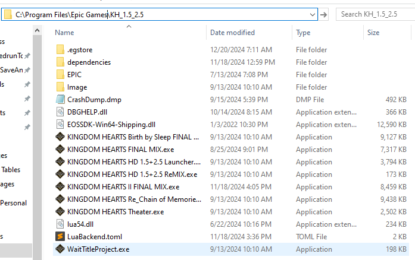
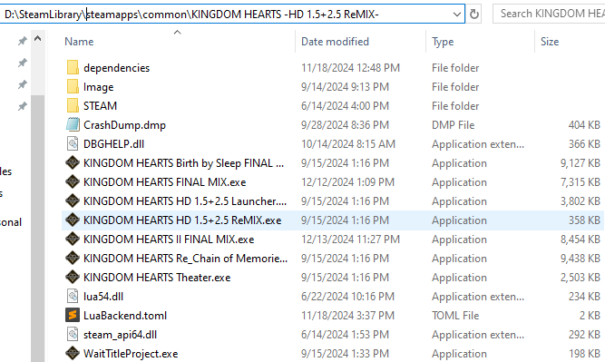
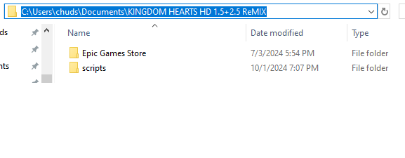
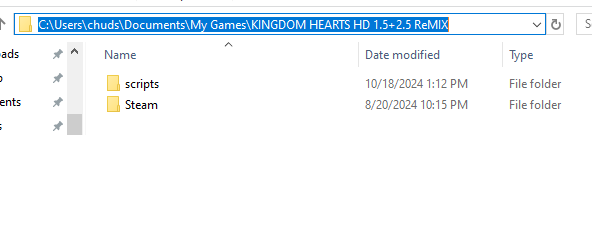
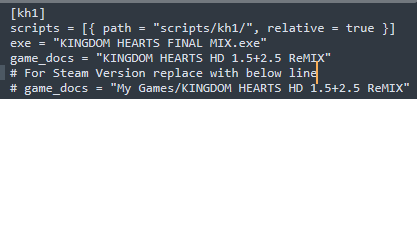
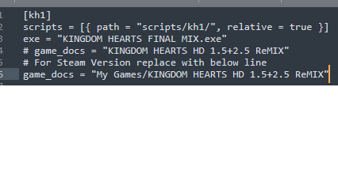
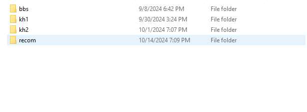
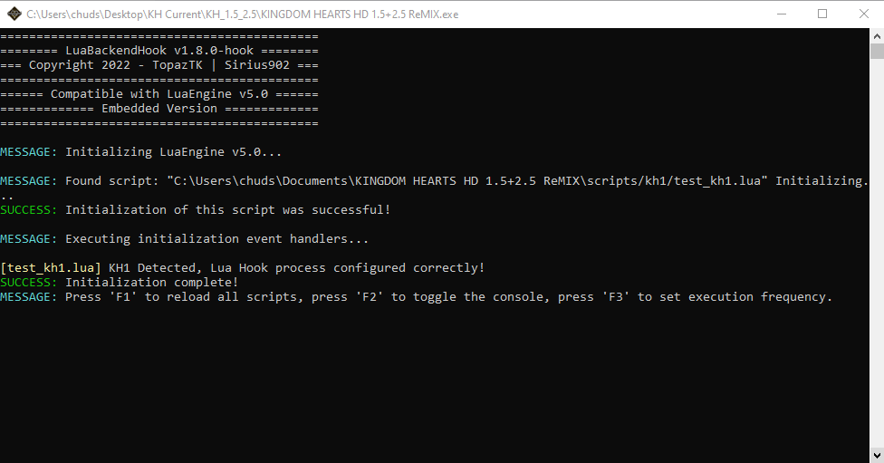

# Setting up
So you are having issues getting things working for one of the Lua tools. Fear not this document will get you squared away!

## LuaBackend

### Install
The first thing you want to do is ensure that you have the three files from the download from https://github.com/Sirius902/LuaBackend (`lua54.dll`, `DBGHELP.dll`(alternatively renamed to `DINPUT8.dll` for Steamdeck), `LuaBackend.toml`) in the game install folder.

For Epic Games that would look like this:

To get there open Epic Games Launcher, go to your `Library`, right click the game and click on `Manage`, on the `Instillation` line click on the folder with a magnifying glass.

For Steam that would look like this:

To get there open Steam, go to the `Properties` for the game, go to the `Installed Files` tab of this menu, and click the `Browse...` button.

### Config
Once this step is complete you want to ensure that you have the correct `game_docs` line inside the .toml file! This points to the folder that the game uses to save data.

For Epic Games that path will look like this:
`KINGDOM HEARTS HD 1.5+2.5 ReMIX`

Since the save location looks like this, with your user name swapped and maybe a different drive:

For Steam that path will look like this:
`My Games/KINGDOM HEARTS HD 1.5+2.5 ReMIX`

Since the save location looks like this, with your user name swapped and maybe a different drive:

Note after this you should have ONE `game_docs` line per game that does not start with a `#` in the .toml file matching what is described above, any additional `game_docs` lines can stay as long as they start with `#` and a space.

For Epic Games this looks like:

For Steam this looks like:

(The above is the setup for all applicable games aside from Dream Drop Distance, for that all of the same steps apply except where `KINGDOM HEARTS HD 1.5+2.5 ReMIX` is used is swapped with `KINGDOM HEARTS HD 2.8 Final Chapter Prologue` and `KH_1.5_2.5` is swapped for `KH_2.8`.)

### Scripts
From here you want to make sure you have the `scripts` folder as seen in the last screenshots. Now inside that folder we will be creating a folder per game you are trying to add mods for!

For Kingdom Hearts 1, 2, Re: Chain of Memories, and Birth by Sleep that looks like this:

(In the case of Dream Drop Distance you will want a folder named `kh3d` instead of any of the above names. This will land in the 2.8 packs save folder as is called out above.)

And inside these is where you will place the mods found in this repo! To perform a test copy one of the `test_game.lua` (where game is replaced by a game abbreviation) files from the `test_lua` folder of the repo into the game specific folder. Once you have, open that game and press `F2`. You will know you are good to go if you get a window that looks like this:

Now you can remove the test file and move on to the other mods in this repository! Follow the steps in the game specific readmes for further instructions and happy gaming!

## LuaFrontend
