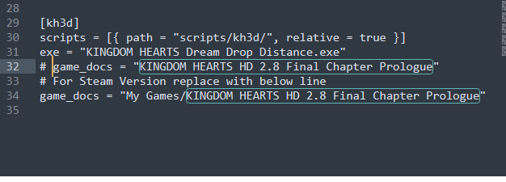
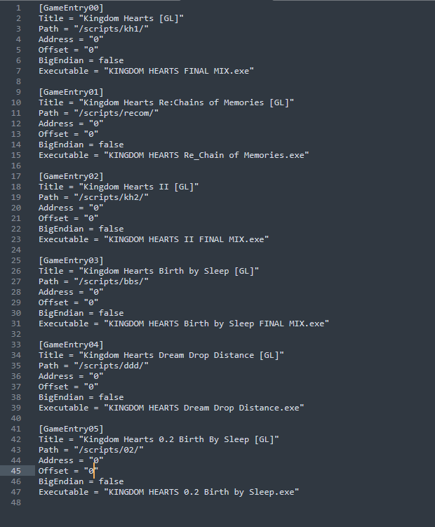
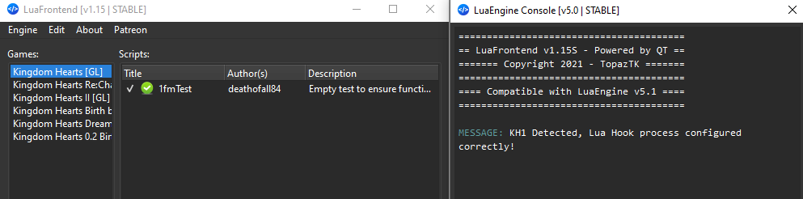
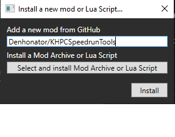

# Setting up
So you are having issues getting things working for one of the Lua tools. Fear not this document will get you squared away! Follow ONE of the bellow setups for a Lua tool, then carry on into game specific mods! This is step one and the game specific document is step two.

## Before you start
If you have not already, or run into language you are unfamiliar with go read through the [glossary](GLOSSARY.md) for terms that are used throughout. If there is word or short hand use that is still unclear please reach out so it can be add!

## Jump to
- [LuaBackend](#lb)
- [LuaFrontend](#lf)
- [OpenKH Mod Manager](#omm)
- [Game Specific Mods](#mods)

## LuaBackend

### Prep
- First locate your `game install` folder:
	- For Epic Games:
		- Open the Epic Games Launcher
		- Go to `Library`
		- Right click the game
		- Click `Manage`
		- Click the magnifying glass on the `Installation` line
	- For Steam:
		- Open Steam
		- Select the game from your `Library`
		- Click the gear icon and select `Properties`
		- Select the `Installed Files` tab
		- Click the `Browse...` button
- In another file explorer window open your `Documents` folder
	- For Epic Games:
		- You should see a folder named `KINGDOM HEARTS HD 2.8 Final Chapter Prologue`
		- Open this folder (this is the `game data` folder moving forward)
		- You should have something like `C:\Users\<your_user_name>\Documents\KINGDOM HEARTS HD 2.8 Final Chapter Prologue`
		- It will look something like this:  
		
	- For Steam:
		- You should see a `My Games` folder
		- Open `My Games` and you should now see a folder named `KINGDOM HEARTS HD 2.8 Final Chapter Prologue`
		- Open this folder (this is the `game data` folder moving forward)
		- You should have something like `C:\Users\<your_user_name>\Documents\My Games\KINGDOM HEARTS HD 2.8 Final Chapter Prologue`
		- It will look something like this:  
		
- Next download `DBGHELP.zip` from [here](https://github.com/Sirius902/LuaBackend/releases) and unzip the contents into the `game install` folder you just found. This will unpack three files, `DBGHELP.dll`, `lua54.dll`, and `LuaBackend.toml`

For Epic Games it should end up looking like this:

For Steam that would look like this:

#### Steamdeck extra steps
- Rename the `DBGHELP.dll` file to `DINPUT8.dll` that you placed in the game install folder
- In the `General` section of game properties on Steam, add the following as the `Launch Options`: `WINEDLLOVERRIDES="dinput8=n,b" %command%`

### Config
Our next goal is to ensure a proper `LuaBackend.toml` file setup:
- Open `LuaBackend.toml` in a text editor (notepade for example)
	- We will be setting the `game_docs` line relative to which platform you are installed on (if you have both you can choose one instead of doing both but they will end up shared)
	- Note after this you should have ONE `game_docs` line per game that does not start with a `#` matching what is described above, any additional `game_docs` lines can stay as long as they start with `#` and a space or be deleted entirely
	- For Epic Games this looks like:  
	
	- For Steam this looks like:  
	

### Scripts
From here on we will be in the `game data` folder we opened earlier.
- Create a new folder called `scripts`
- Inside the new `scripts` folder create a folder called `kh3d`

It should then look like this:

### Testing

As a last step we are going to run a test.

- In the newly created `kh3d` folder copy the `test_ddd.lua` found in the [test_lua](test_lua) folder
- Boot the game either through Steam or Epic Games
- Start up Kingdom Hearts Dream Drop Distance from the KH Launcher
- Once DDD is loaded Press `F2`
- You will know you are good to go if you get a window that looks like this:  

- To clean up delete `test_ddd.lua` and continue from the [game specific link](#mods)

## LuaFrontend

### Install

Grab the most recent release .rar file from [here](https://github.com/TopazTK/LuaFrontend/releases) and extract it wherever you like, this will be the `extracted folder`.

### Config

- Open the newley `extraced folder`
- Open the `config` folder inside
- Open the `gameConfig.toml` file from this folder in a text editor (notepade for example)
- Set each `Offset` and `Address` line to `"0"`
- (Optional, but recommended for this guide) Change the `Path` lines that include a `gl` to remove the `gl`

You should end up with a file that looks like this:  

### Scripts

- Go back to the top level of the `extracted folder` (should be the folder named `LuaFrontend.v1.15` or something similar unless you renamed it)
- Open the `scripts` folder
- Rename or replace the folders here to match what you did in the `Path` lines from the config step so that you end up with something that looks like this:  

### Testing

As a last step we are going to run a test.

- If you closed it re-open the `scripts` folder
- In the `ddd` folder copy the `test_ddd.lua` found in the [test_lua](test_lua) folder
- Boot the game either through Steam or Epic Games
- Start up Kingdom Hearts Dream Drop Distance from the KH Launcher
- Once DDD is loaded, run `LuaFrontend.exe` from the `extracted folder`
- Inside the new window click the `Engine` option in the top left
- Select `Show Console...`
- Click `Engine` again
- Select `Start Engine`
- You should end up with a window that looks like this (the image is the kh1 reference yours will say ddd):  

- To clean up delete `test_ddd.lua` and continue from one of the [game specific links](#mods)

## Open KH Mod Manager

### Install
Grab the most recent release .zip file from [here](https://github.com/OpenKH/OpenKh/releases) and extract it where ever you like, this will be the `extracted folder`.

### Config
- Open the newly `extracted folder`, find and run `OpenKh.Tools.ModsManager.exe`
- If it is the first time it will run through their wizard. If you change platforms or languages at a later point go through the wizard again to change the configurations
- In the wizard:
	- Choose `PC Release`, your language, and your platform and click `Detect Installations` then click `Next`
	- If you intend to use any non `.lua` mods (things from other creators like visual mods), select the game collection at the top and go ahead and add Panacea on this page otherwise just click `Next`
	- Make sure to select the proper game collection on this page, tick the boxes for any games you plan to have mods for, and click `Install and Configure Lua Backend`. Follow up with hitting `Next` again
	- Once again if you plan to have any non `.lua` mods you will need to follow the steps on this stage to extract the game assets for moddification. This page is only for people using things not included in this repo. Tick the `Skip Game Extraction` box and click `Next` in all basic `.lua` use cases
	- On the last page click `Finish`
	- As a note the mod manager may crash out at this stage if being configured for Epic Games this is fine, just boot it again

### Scripts
This repo is a collection of mods in the eyes of OpenKH, this means you can select from the present mods which ones you want on at any given time.

Now there are only three simple steps left, install this repository, run with a test mod and select your optional mods!

#### Install the Repository
- Open the mod install window with the green plus, from the mods drop down, or the appropriate keyboard shortcut
- In the new window put in the repo info (Denhonator/KHPCSpeedrunTools) like so:  

- Feel free to set this to auto update, to make sure your mods stay working at all times!
- You now have all of the required files to run any of the mods for any of the games!

#### Testing
- Click on to highlight the mod in the Mod Manger window with the name of this repository you just install
- On the right side of the screen you will see a button that says `Collection Settings` like so:

- You should get a new pop up window like this:

- Select `test_kh1.lua` (or the game specific one for your selected game) and close the popup
- Ensure that the check box for the collection is ticked like so:

- In the `Patching` menu at the top select one of `Build and Patch` or `Build and Fast Patch`
- Launch Kingdom Hearts through Steam or Epic Games
- Launch Kingdom Hearts 1 (or the game you are using)
- Once the game is loaded press `F2`
- You will know you are good to go if you get a window that looks like this:  

- To clean up, return to the `Collection Settings` menu via the button, and uncheck the `test_kh1.lua` file you checked in this step. 

#### Selecting mods
- Like you did to test, open the `Collection Settings` menu via the button
- Click the check boxes for any mods you wish to run with
- Build from the Patching menu
- Profit!

## Game Specific Mods

For Frontend or Backend follow these links to get to the mods for the given game as well as further documentation on how to use them:

- [Kingdom Hearts Dream Drop Distance](DDDMods)
