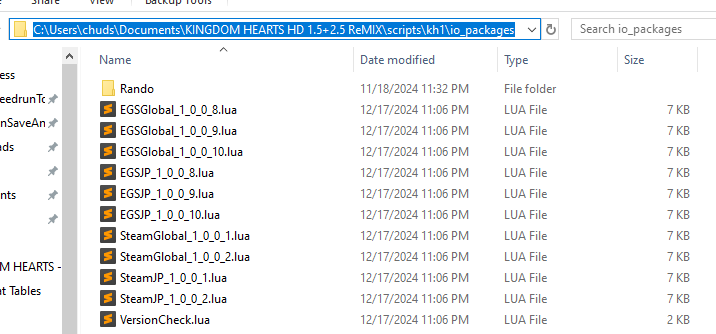
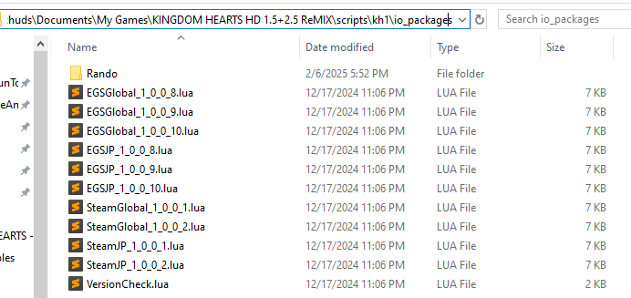
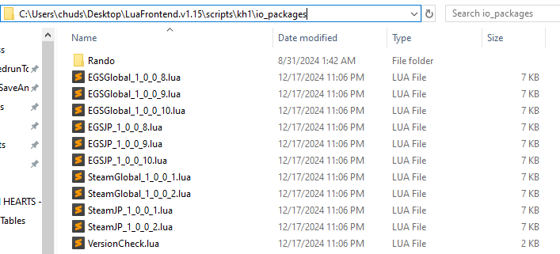

# Setting up
If you have not, follow the steps [here](LUA.md) first! Otherwise there are three pieces to this:
- First we need to ensure that the Rando lua files are setup.
- Second we need to ensure the `randofiles` folder is created, and optionally populated with any lanugae files you might want.
- Third is to configure settings to your liking!

## Disclaimer
A warning, when using the OpenKH Mod Managers `build` or `build and run` operations the `settings.lua` file will be reset as it will be rebuilt from the base.

## Jump to
- [LuaBackend or LuaFrontend](#lblf)
- [OpenKH Mod Manager](#omm)
- [Rando Files](#rfiles)
- [Settings](#set)

## LuaBackend or Lua Frontend - Rando Folder Setup

This is the same for either method with a minor change in folder location. All we need to do is copy the `Rando` folder from the repositories `io_packages` folder in.

### LuaBackend

- The folder location will be inside the `kh1` scripts folder we setup before, this should be located at:
	- For Epic Games:
		- `Documents/KINGDOM HEARTS HD 1.5+2.5 ReMIX/scripts/kh1/io_packages`
	- For Steam:
		- `Documents/My Games/KINGDOM HEARTS HD 1.5+2.5 ReMIX/scripts/kh1/io_packages`
- Copy the `Rando` folder (from this repository, in the 1FMMods io_packages) and it's contents to this location, it should end up looking like this:
	- For Epic Games:
		
	- For Steam:
		

### LuaFrontend

- The folder location will be inside the `kh1` scripts folder we setup before, this should be located at:
	- `<unzipped folder location>/LuaFrontend.v1.15/scripts/kh1/io_packages`
- Copy the `Rando` folder (from this repository, in the 1FMMods io_packages) and it's contents to this location, it should end up looking like this:

## OpenKH Mod Manager - Rando Folder Setup

For Open KH Mod Manager this step is taken care of for you by the install and build of this repository!

## Rando Files

The last part to ensure proper running is to create and optionally populate the `randofiles` folder. This will be going in the previously discussed `install folder` if you closed that window from the previous steps here is how to get there again:

- Locate your game install folder:
	- For Epic Games:
		- Open the Epic Games Launcher
		- Go to `Library`
		- Right click the game
		- Click `Manage`
		- Click the magnifying glass on the `Installation` line
	- For Steam:
		- Open Steam
		- Select the game from your `Library`
		- Click the gear icon and select `Properties`
		- Select the `Installed Files` tab
		- Click the `Browse...` button

For Epic Games it should end up looking like this:

For Steam that would look like this:

Now if you are playing on english all that is left is to create a new folder here and call it `randofiles`. This will be where all generated files are stored.

Optional: If you are playing on French, German, or Spanish there is some support for the translated names of things. Copy the language specific `.txt` file from the repository `randofiles` folder found [here](1FMMods/randofiles) into the newly created folder.

##  Settings

As was called out above for Open KH Mod Manager this file will be overwritten any time the `Build` action is take in mod manager so keep that in mind and maybe save off a copy of the file in another location to make your life easier!

I am not going to get in to the nitty gritty of what each setting does but the `settings.lua` can be found in the following locations:
- For LuaBackend:
	- For Epic Games:
		- `Documents/KINGDOM HEARTS HD 1.5+2.5 ReMIX/scripts/kh1/io_packages/Rando`
	- For Steam:
		- `Documents/My Games/KINGDOM HEARTS HD 1.5+2.5 ReMIX/scripts/kh1/io_packages/Rando`
- For LuaFrontend:
	- `<unzipped folder location>/LuaFrontend.v1.15/scripts/kh1/io_packages/Rando`
- For Open KH Mod Manager:
	- `<unzipped folder location>/openkh/mod/kh1/scripts/io_packages/Rando`

This file controls various things outlined in detail inside the `settings.lua` file itself to configure how your randomizer experience goes, change it as you see fit or leave it at default, the choices are yours.
